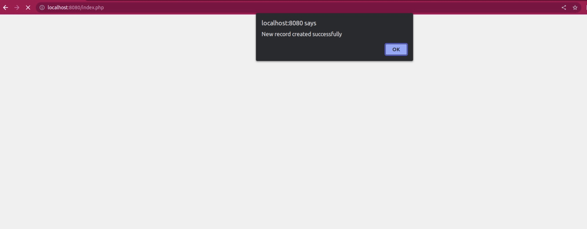

```markdown

# Author: ANUGRIH CHOUBE (g23ai2033)


# Docker Application Deployment

## Step 1: Deploy a Sample Web Application Using Docker Containers

### 1. Install Docker

Check whether docker is installed on Linux machine:

```bash

sudo apt-get update

sudo apt-get install -y docker.io

```

### 2. Create Project Directory

Create a directory for your project and navigate into it:

```bash

mkdir docker_assignment

cd docker_assignment

```

### 3. Copy `index.php` to Project Directory

```bash

cp /mnt/data/index.php .

```
### 4. Create a mysql container

```bash
#Pull mysql
sudo docker pull mysql

#List docker images
docker images

# 1. Create any container name (eg. student_db)
# 2. Use any port for mysql to run (eg. 3306:3306)
# 3. -v Provide the volume path to persist data.
# 4. -d Run the container in detach mode.
# 5. -e "MYSQL_ROOT_PASSWORD=root", Sets the root password of mysql to "root".

# Run the mysql container
docker run --name student_db  -p 3306:3306 -v mysql_volume: /var/lib/mysql/ -d -e             "MYSQL_ROOT_PASSWORD=root" mysql

# Check Running Containers
sudo docker ps

# To Start the container 
sudo start [container_id]

# Access the mysql containers
sudo docker exec -it student_db bash

# In bash create the required database using command with password as root
mysql -u root -p

# Fetch the IP address required to put while connecting to mysql database

sudo docker inspect student_db

```

### 5. Create a Dockerfile

Create a file named `Dockerfile` in the project directory and add the following in it:

```Dockerfile

# Use an official PHP runtime as a parent image
FROM php:7.4-apache

# Install mysql in docker image
RUN docker-php-ext-install mysqli

# Copy the current directory contents into the container at /var/www/html
COPY index.php /var/www/html/

# Expose port 80 to the outside world
EXPOSE 80

# Run Apache in the foreground
CMD ["apache2-foreground"]

```

### 6. Build the Docker Image

Build the Docker image with the following command:

```bash

sudo docker build -t g23ai_2033_assignment .

```

### 7. Run the Docker Container

Run the Docker container with the following command:

```bash

sudo docker run -p 8080:80 my-php-app g23ai_2033_assignment

```

### 8. Access the Application

Open a web browser and navigate to `http://localhost:8080` to see the PHP application running.


### Reference images

1. When the user fills the data


2. User Named IITJ User , BTECH, IIT JODHPUR is added.



2. After the user Fills the data, the record is updated to the database and the user is visible in records.


